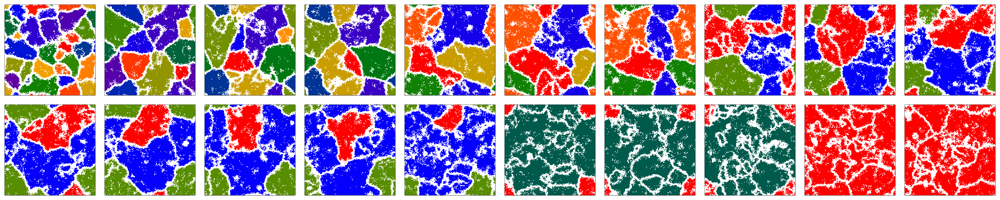
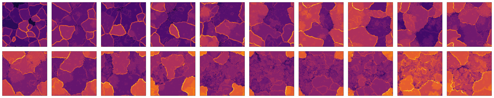

# _Streptomyces coelicolor_ Cellular Automata
Reproduction of the model of mutation-driven division of labor in the
antibiotic-producing bacterium _Streptomyces coelicolor_ by Colizzi _et al._
from their paper _"Evolution of genome fragility enables microbial division of labor"_ ([bioRxiv](https://www.biorxiv.org/content/10.1101/2021.06.04.447040v5.abstract)).
Rewritten in Julia for learning and benchmarking purposes only.

  <i>Bacterium colonies over 20 growth cycles.</i>

  <i>Antibiotics density over 20 growth cycles (relative colormap normalization).</i>

